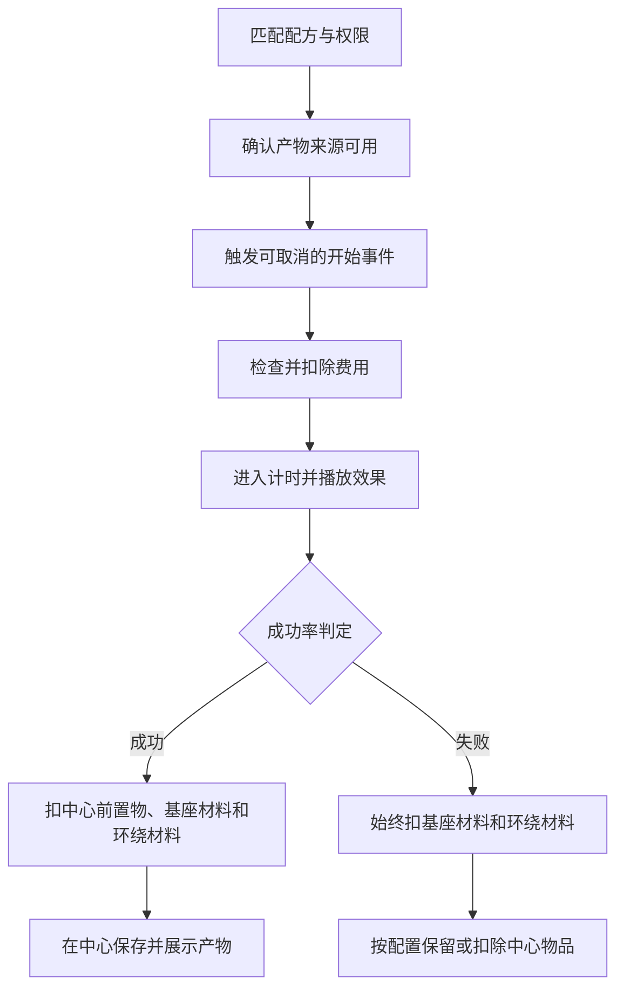

# 经济、成功率与失败

## 合成结算顺序



## 成功概率

```yaml
success-chance: 70.0
```

范围为 `0.0-100.0`：

- `100.0`：必定成功；
- `0.0`：必定进入失败结算；
- 判定在合成计时结束时执行。

## 失败时材料规则

```yaml
keep-altar-item-on-failure: true
```

无论此选项为何值，概率失败都会消耗配方所需的全部基座材料；`ADVANCED` 配方的环绕材料也始终按要求数量消耗。

| 配置 | 概率失败时的中心物品 |
| --- | --- |
| `true` | 保留，不扣除 |
| `false` | 扣除配方所需数量 |

失败会播放 `crafting.failure-sound`，不会产生结果物品，也不会发送成功播报。

## 免费配方

```yaml
cost:
  type: NONE
  amount: 0
```

## Vault 金币

需要 Vault 和已注册 Vault 经济服务的经济插件：

```yaml
cost:
  type: VAULT
  amount: 500
```

余额不足、Vault 不可用或扣款失败时，合成不会开始，也不会消耗祭坛物品。

## 指令型点券

需要 PlaceholderAPI 提供余额，再由控制台指令扣除和退款。

配方：

```yaml
cost:
  type: POINTS
  amount: 100
```

`config.yml`：

```yaml
economy:
  points:
    balance-placeholder: '%playerpoints_points%'
    withdraw-commands:
      - 'points take {player} {amount}'
    refund-commands:
      - 'points give {player} {amount}'
```

变量：

- `{player}`：发起合成的玩家名；
- `{amount}`：费用数量，整数不会附带 `.0`。

余额变量返回内容中必须包含可解析数字，且不能仍然保留未解析的 `%变量%`。

## 玩家经验等级

`XP` 不需要任何前置插件，直接检查并扣除发起合成玩家的经验等级：

```yaml
cost:
  type: XP
  amount: 30
```

上述配置表示扣除玩家 **30 级**，不是扣除 30 点经验值。`amount` 必须是大于 0 的整数；若玩家只有 29 级，合成不会开始，也不会扣除材料或等级。

玩家主动取消、退出服务器、插件重载或结构失效时，已扣等级会原数退回。正常成功或概率失败属于完整结算，不退还等级。

## 什么时候退款

| 情况 | 是否退款 |
| --- | --- |
| 玩家主动取消合成 | 是 |
| 管理员取消合成 | 是 |
| 插件重载或关闭 | 是 |
| 计时中结构失效 | 是 |
| 玩家离线导致取消 | 是 |
| 产物无法生成 | 是 |
| 保存结算数据失败 | 是 |
| 正常合成成功 | 否 |
| 概率判定失败 | 否 |

## 成功播报

```yaml
broadcast: '<gradient:#ff557f:#ff55fd>恭喜玩家 <green>{player}</green> 合成出了 {recipe}</gradient>'
```

支持：

- MiniMessage 渐变、RGB 和样式标签；
- `{player}`：玩家名；
- `{recipe}`：配方显示名称；
- PlaceholderAPI 百分号变量。

留空字符串 `''` 即可关闭播报。
