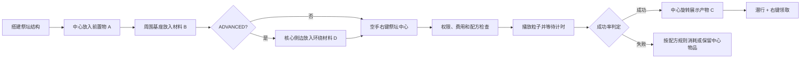

# BlockCraft Wiki

欢迎使用 **BlockCraft 1.0.13**。这是一个面向 Paper/Folia 1.21.11 的多方块祭坛合成插件，玩法参考植物魔法式的环形基座合成：玩家把前置物放到祭坛中心，把材料放到周围基座，再启动具有粒子、音效、成功率和费用判定的合成。

> 平台兼容性：兼容 Paper 26.2 与 Folia 1.21.11，默认走统一调度器兼容层。

## 核心特性

- 自定义祭坛核心、基座方块和相对坐标；
- 原版方块和 CraftEngine 自定义方块结构；
- 任意多组纯结构支持方块，必须全部满足才允许使用祭坛；
- 原版、MMOItems、CraftEngine、CustomFishing 四种物品来源；
- 手中整组物品一次放入，超出配方需求的数量会保留；
- `NORMAL` 传统合成与 `ADVANCED` 祭坛环绕材料合成；
- 中心前置物 + 基座材料 + 可选环绕材料 = 最终产物；
- 祭坛中心、每个基座材料、环绕材料和最终产物独立调整高度与大小，并旋转浮动展示；
- 可配置悬浮名称、四种粒子轨迹、逐结构粒子覆盖和完整音效；
- Vault 金币、PlaceholderAPI 指令型点券、玩家经验等级、成功概率和失败规则；
- 完全自定义的只读配方预览 GUI；
- 多文件配方目录、MiniMessage 消息、公共查询 API 和合成事件。

## 运行环境

| 项目 | 要求 |
| --- | --- |
| 服务端 | Paper 26.2 / Folia 1.21.11 |
| Java | Java 25 |
| 必需前置 | 无 |
| 自定义物品 | MMOItems + MythicLib、CraftEngine 26.7.x、CustomFishing 2.3.x，按需安装 |
| 金币 | Vault + 任意 Vault 经济实现，按需安装 |
| 点券 | PlaceholderAPI + 能提供余额变量和控制台增减指令的点券插件 |

所有外部插件都是软依赖。缺少某个前置时，只停用对应物品来源或费用方式，原版配方仍然可用。

## 获取与价格

- 当前优惠价：**¥88**
- 原价：~~¥108~~

站点只展示当前价格，具体交付方式、授权范围和后续更新服务以购买时说明为准。

## 合成流程

## 从这里开始

1. [[安装与更新|Installation]]
2. [[平台兼容性|Compatibility]]
3. [[五分钟快速开始|Quick-Start]]
4. [[多方块结构|Multiblock-Structures]]
5. [[配方配置|Recipe-Configuration]]
6. [[物品来源与前置挂钩|Item-Sources]]

遇到配方不匹配、结构识别失败或自定义物品无法生成时，请前往 [[故障排查|Troubleshooting]]。
