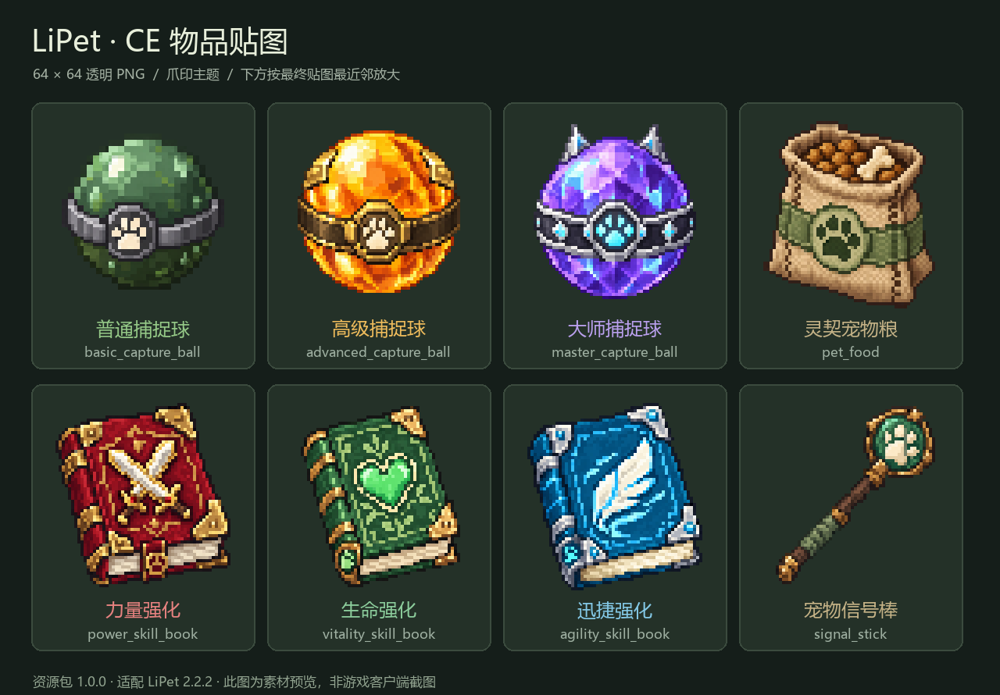

# CE 物品贴图

这是一套可选的 **LiPet CE 物品贴图包 1.0.0**，兼容 **LiPet 2.2.2 及后续版本**。它提供 8 件物品的 64×64 外观、CE 定义与 LiPet 配置合并片段，安装这套外观本身不要求更换 Jar。LiPet 2.2.3 的捕捉品质聊天提示不需要更新纹理。



预览用于查看整体设计。实际安装纹理统一为 64×64 透明 PNG；按已确认方案以脚本最近邻转换，并清理半透明边缘。图像工具生成的高清原图完整保留在资源包的 `generated/`，没有被最终纹理覆盖。

## 8 件物品与完整 ID

| 物品 | CE 完整 ID | LiPet 外观配置节点 |
| --- | --- | --- |
| 普通捕捉球 | `lipet:basic_capture_ball` | `capture.yml → balls.basic.material` |
| 高级捕捉球 | `lipet:advanced_capture_ball` | `capture.yml → balls.advanced.material` |
| 大师捕捉球 | `lipet:master_capture_ball` | `capture.yml → balls.master.material` |
| 力量强化技能书 | `lipet:power_skill_book` | `skills.yml → skills.power.book.material` |
| 生命强化技能书 | `lipet:vitality_skill_book` | `skills.yml → skills.vitality.book.material` |
| 迅捷强化技能书 | `lipet:agility_skill_book` | `skills.yml → skills.agility.book.material` |
| 宠物信号棒 | `lipet:signal_stick` | `items.yml → signal-stick.material` |
| 灵契宠物粮 | `lipet:pet_food` | `pet-types.yml → defaults.growth.foods.craftengine_example.item-id` |

三本书对应现有的被动属性强化技能。插件的 112 项主动技能及其粒子、音效和模型动画继续使用原系统，不会被这套资源改成 112 本书。

## 安装与配置合并

1. 备份 `plugins/LiPet` 和相关 CE 资源。备份放在 CE 扫描目录以外。
2. 如果装过旧 `lipet_capture_example` 包，先保留其自定义名称和配方，再把旧包移到 `plugins/CraftEngine/resources/` 以外；它与新包都定义 `lipet:basic_capture_ball`，不能同时加载。检查其他包没有重复的 8 个 ID，不删除 CE 物品编号或方块状态缓存。
3. 将资源包内的 `plugins/CraftEngine/resources/lipet_items` 复制到服务器相同位置；该目录直接包含 `pack.yml`、`configuration/` 和 `resourcepack/`。
4. 把 `LiPet配置合并片段/` 内对应节点手工合并到现有配置。`.merge.yml` 是片段，不能覆盖整份文件。只更换球、书、棒的 `material`，保留原名称、概率、技能数值、价格、权限和其他食物。
5. 宠物粮可选，使用时合并 `pet-types-food.optional.merge.yml`。已有自定义 `craftengine_example` 时保留原定义，另用配置键；设置了 `inherit-defaults: false` 的宠物需在自身 `growth.foods` 下单独配置。
6. 管理员执行 `/ce reload all`，确认没有重复 ID 或资源缺失并完成原有资源包分发，再执行 `/lipet reload` 读取物品映射。玩家接受并重新加载服务器生成的资源包后才会显示新外观。

旧 [CE 配方示例](CE配方捕捉球.md) 可能使用 `balls.ce_basic`。可以保留这个球种和原概率，仅沿用同一 CE 物品外观；如果改为 `balls.basic`，应先合并需要保留的设置并停用重复球种。同一个完整 CE ID 只能映射一个启用的捕捉球定义。

上述步骤仅重载资源与配置。如果运行服需要升级 LiPet Java 代码，仍应正常停服替换 Jar。资源包不自动修改生产配置或数据库，也不自动批量转换玩家历史库存。

## 捕捉球与已有配方

合并对应 `capture.yml` 映射后，CE 配方或 CE 发放的原始捕捉球可直接捕捉，无需先由 LiPet 发放。普通底材物品不会因此获得捕捉功能。

本包保留已有普通球工作台配方：

| 空 | 史莱姆球 | 空 |
| --- | --- | --- |
| 史莱姆球 | 铁锭 | 史莱姆球 |
| 空 | 史莱姆球 | 空 |

每次消耗 4 个原版史莱姆球和 1 个铁锭，产出 1 个 `lipet:basic_capture_ball`。高级球、大师球、技能书、信号棒和宠物粮没有新增合成配方，发放沿用服务器设置。捕捉概率和失败是否消耗继续由 LiPet 控制。

## 技能书、信号棒与喂食

技能书和信号棒需要 LiPet 写入功能标记，使用以下指令发放；单独 `/ce give` 得到的原始书和棒只有外观，不能代替带学习或控制模式标记的物品：

```text
/lipet skillbook power 1 玩家名
/lipet skillbook vitality 1 玩家名
/lipet skillbook agility 1 玩家名
/lipet signalstick 1 玩家名
```

启用可选食物片段后，原始 CE `lipet:pet_food` 可直接右键喂养符合条件的宠物。示例沿用插件原 CE 食物数值：经验 4、治疗 8、自由属性点 0、最低等级 1、最高等级 0（不限制）。服主现有数值优先保留，肉类、鱼类等原食物不受影响。不安装食物片段时，这件物品不会自动成为可食用的宠物粮。

可先用 `/lipet status lipet:basic_capture_ball` 检查物品构建，其余 7 个完整 ID 同样适用。

## 验证与交付边界

资源静态验证 **109/109 项通过**，涵盖 8 张 64×64 纹理、透明边界、8 个模型、CE 完整 ID、资源引用、旧配方及配置合并范围。

隔离环境使用 **Paper 26.2 Build 111、CraftEngine 26.8.1、LiPet 2.2.2**，结果如下：

| 验证范围 | 结果 |
| --- | --- |
| CE 真实物品构建、完整 ID、LiPet 捕捉识别、书棒标记与已有配方注册 | 100 项运行检查通过 |
| CE 实际生成资源中的 8 张 PNG 与 8 个模型 | 16 项文件检查通过；PNG 与交付的 64×64 文件逐字节一致，模型内容一致 |
| CE 实际生成的客户端物品定义指向相应模型 | 8 项引用检查通过 |

原始 CE 球和配方产物能被 LiPet 识别；LiPet 发放的书和棒保留 CE ID 与模型组件，同时获得功能标记；原始 CE 书和棒没有这些标记。CE 资源包生成完成，未发现本包资源警告或错误，隔离服已正常关闭，生产配置与数据库未改动。

安装内容是 `plugins/CraftEngine/resources/lipet_items` 和需要手工合并的 LiPet 片段。隔离测试生成的 `resource_pack.zip` 仅用于验证，不能作为覆盖生产服务器全部资源的最终合并包；应让生产服 CE 按现有全部资源重新生成并沿用原分发流程。

静态和隔离服务端检查不能代替真人客户端验收。本次没有真人连接客户端，也没有真人点击工作台或使用书、棒、食物；仍需进服检查背包、手持、掉落物、合成产物及功能物品的外观和操作。`F:/26.2` 的交付只放入待更新目录，不代表生产服已安装或客户端已加载。

独立贴图包版本保持 1.0.0；本包不覆盖任何既有插件发行包，后续插件消息更新也不要求重新制作纹理。上方运行验证记录对应当时使用的 LiPet 2.2.2。
